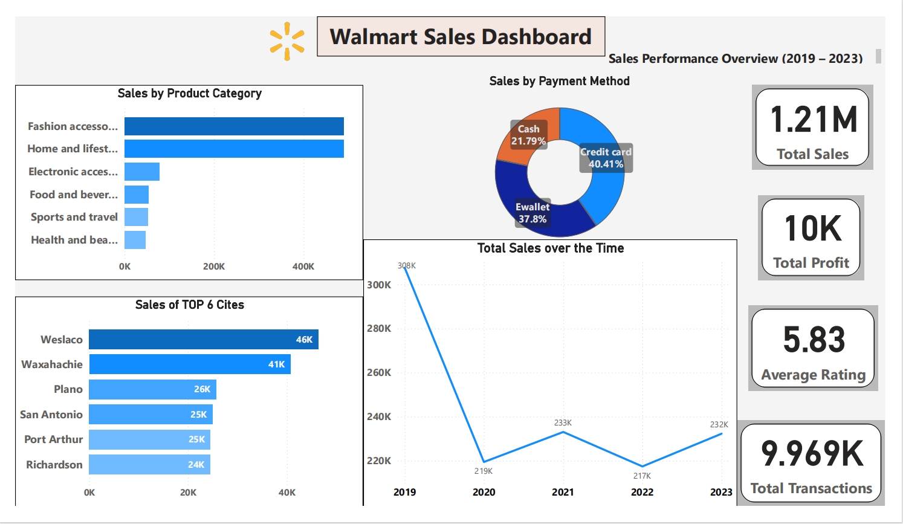

# Walmart Sales Analysis: A Comprehensive Business Intelligence Project  

## Project Overview  
This project presents a comprehensive analysis of the Walmart sales dataset, leveraging a powerful combination of **Python, SQL, and Power BI** to extract actionable insights.  

The primary goal is to:  
- Understand **sales trends**  
- Identify **top-performing branches and product categories**  
- Uncover **customer behavior patterns** to inform strategic business decisions  

The workflow begins with:  
1. Data cleaning and exploratory data analysis (EDA) in **Python**  
2. In-depth querying in a **SQL database** to answer specific business questions  
3. Interactive dashboards created in **Power BI**  

---

## Dashboard Screenshot

(Screenshot of your final Power BI dashboard)  

---

## Technologies Used  

### 🔹 Data Cleaning & EDA  
- **Python**: The core programming language for data manipulation  
- **Pandas**: For efficient data loading, cleaning, and transformation  
- **Matplotlib & Seaborn**: For creating static, insightful visualizations during the exploratory phase  
- **Jupyter Notebook**: As the interactive development environment  

### 🔹 Database & Querying  
- **SQL (PostgreSQL)**: For storing the cleaned data and performing complex queries to answer business problems  

### 🔹 Business Intelligence & Visualization  
- **Microsoft Power BI**: To create dynamic, interactive dashboards for a comprehensive visual analysis and business performance tracking  

---

## Project Workflow  
The project followed a structured, multi-stage process:  

### 1. Data Cleaning and Preprocessing (Python)  
- The raw CSV data was loaded into a Pandas DataFrame  
- Missing values were identified and handled appropriately  
- Data types were checked and corrected (e.g., converting `date` and `time` columns to datetime objects)  
- New features were engineered, such as **Day of Week** and **Hour**, to facilitate deeper analysis  

### 2. Exploratory Data Analysis (EDA) (Python)  
- Using Matplotlib and Seaborn, initial visualizations were created to:  
  - Understand the data's distribution  
  - Identify correlations  
  - Uncover preliminary trends in sales, ratings, and product categories  

### 3. SQL Database Integration and Analysis  
- The cleaned dataset was exported and loaded into a SQL database  
- A series of targeted business questions were formulated and answered using complex SQL queries  
- This allowed for robust and scalable data analysis  

### 4. Dashboard Creation (Power BI)  
- The cleaned data was connected to Power BI  
- Key Performance Indicators (KPIs) such as **Total Sales, Total Profit, and Average Customer Rating** were calculated  
- Two interactive dashboards were built:  
  - **Sales Overview**: A high-level view of overall performance, including sales over time, by category, and by location  
  - **Profitability & Customer Insights**: A deeper dive into the most profitable product categories, customer satisfaction ratings, and sales performance by payment method  

---

## Key Business Questions Addressed in SQL  

- What are the different payment methods, and how many transactions and items were sold with each method?  
- Which category received the highest average rating in each branch?  
- What is the busiest day of the week for each branch based on transaction volume?  
- How many items were sold through each payment method?  
- What are the average, minimum, and maximum ratings for each category in each city?  
- What is the total profit for each category, ranked from highest to lowest?  
- What is the most frequently used payment method in each branch?  
- How many transactions occur in each shift (Morning, Afternoon, Evening) across branches?  
- Which branches experienced the largest decrease in revenue compared to the previous year?  

---

## How to Reproduce the Project  

### 1. Clone the Repository  
```bash
git clone https://github.com/your-username/walmart-sales-analysis.git
cd walmart-sales-analysis
